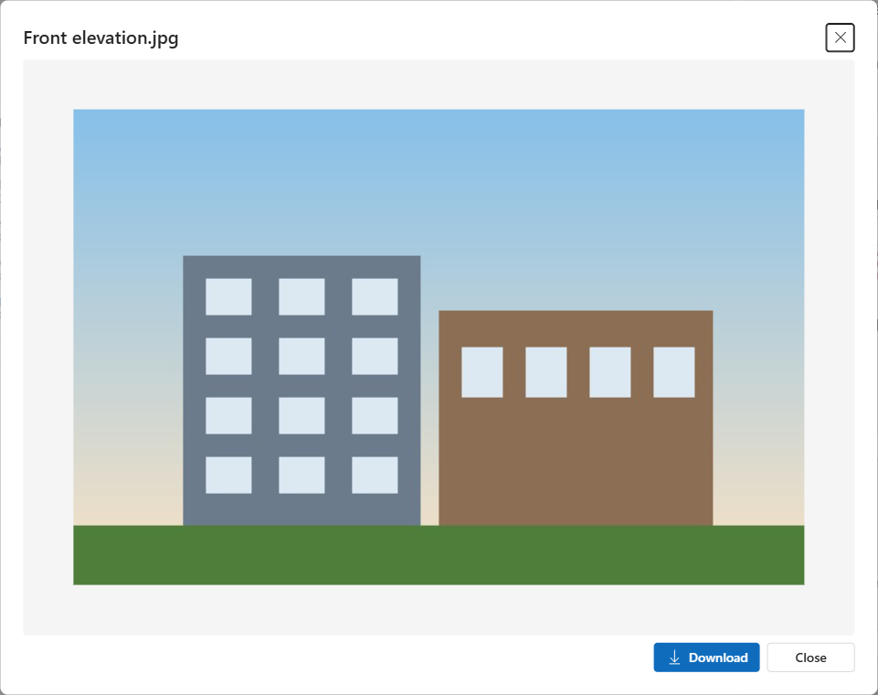

# File Drop Zone

Drag-and-drop file upload for Dynamics 365 / Dataverse model-driven forms. Files are saved as **Note attachments** (`annotation`) on the current record, so they show in the timeline and work with everything that already reads Notes.

  [](https://github.com/ankitrana/PCF-Controls/actions/workflows/file-drop-zone.yml)


📘 **[User guide](docs/user-guide.md)**: install, add to a form, every setting explained, security and troubleshooting. Also as [Word](docs/FileDropZone-User-Guide.docx) and [PDF](docs/FileDropZone-User-Guide.pdf).

🧭 **[Setup walkthrough](docs/setup-walkthrough.html)**: every screen you go through to put the control on a form (build, import, file settings, table, form, component, publish), with numbered pins on each screen. It is a web page: download it (Download raw file) together with the `docs/img` folder, or open it from a clone, in any browser.

## Features

- **Drop, browse or paste**: drop files or whole folders, pick them with the file dialog, or paste screenshots with Ctrl+V.
- **Follows your environment's rules**: reads the org's maximum file size, blocked extensions and blocked/allowed MIME types, so users see the reason *before* uploading instead of a server error.
- **Large files**: files over 4 MB are sent in blocks with a % progress bar and a Cancel button.
- **Duplicates**: if a file with the same name is already attached, choose **Replace**, **Keep both** or **Skip**.
- **Existing attachments**: list with thumbnails for images, preview (images, PDF, text), download and delete.
- **Safe defaults**: read-only forms show the list without upload or delete; new records ask to be saved first; Dataverse security always applies.
- **Modern UI**: React + Fluent UI v9, uses the app's theme. Small bundle (~60 KB) because React and Fluent come from the platform.



## Settings

Add the control to **any single line text column** on the form (the control never changes that column's value).

| Setting | Default | Description |
|---|---|---|
| Allowed file types | *(empty)* | Optional, e.g. `.pdf,.docx,.png`. Empty = everything the environment allows. |
| Max file size (MB) | *(empty)* | Optional, to be stricter than the environment limit for this form. |
| Max files per drop | 10 | How many files can be added in one go. |
| Note title | *(empty)* | Title for each Note. Empty = file name. |
| Show existing attachments | Yes | List the record's attachments. |
| Allow delete | Yes | Show the delete button (security roles still apply). |
| Show image thumbnails | Yes | Small previews for image attachments. |

> Note: the environment's *Maximum file size* (System Settings > Email) applies to the base64 size, so the real file limit is about 3/4 of it (the default 5 MB setting allows files up to 3.75 MB).

## Install

Download **`ArtFileDropZone_managed.zip`** from the latest `FileDropZone-v*` release on the [Releases page](https://github.com/ankitrana/PCF-Controls/releases), then in [make.powerapps.com](https://make.powerapps.com) go to **Solutions** > **Import solution** and import it. The [user guide](docs/user-guide.md) has the full steps.

## Build

Requirements: Node.js 18+ and the [Power Platform CLI](https://learn.microsoft.com/power-platform/developer/cli/introduction).

```bash
npm ci
npm run build
```

Try it locally in the PCF test harness (runs in demo mode with in-memory files):

```bash
npm start watch
```

## Deploy

Quick push to a **development** environment:

```bash
pac auth create --environment https://yourorg.crm.dynamics.com
pac pcf push --publisher-prefix <yourprefix>
```

Or build the solution zips yourself (publisher AnkitRanaTech, prefix `art`). The [.NET SDK](https://dotnet.microsoft.com/download) is also needed:

```bash
dotnet build Solution/FileDropZoneSolution.cdsproj -c Release
```

This writes the managed solution to `Solution/bin/Release/FileDropZoneSolution.zip`.

### Releasing (maintainer)

Bump the version in `ControlManifest.Input.xml`, `package.json` and `CHANGELOG.md`, commit, then push a tag `FileDropZone-v<version>`. CI checks that the tag matches the manifest, builds the managed solution and publishes a GitHub release with `ArtFileDropZone_managed.zip` attached.

Then in the form designer: select a single line text column > **Components** > **+ Component** > **File Drop Zone (AnkitRana-Tech)**, set the options, save and publish.

## Roadmap

- SharePoint document location as an upload target
- Phone camera capture and photo resizing before upload
- Rename / add note text per file, search and bulk actions in the list
- Translations (.resx)

See [CHANGELOG.md](CHANGELOG.md) for version history.

## License

[MIT](../LICENSE) © Ankit Rana
