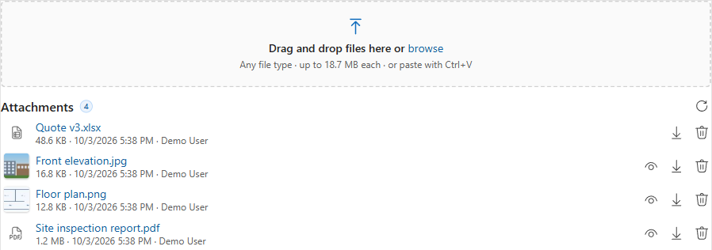

# File Drop Zone - User Guide

**Version 0.2.0** · PCF control for Dynamics 365 / Dataverse model-driven apps · by Ankit Rana

File Drop Zone adds a drag-and-drop upload area to any model-driven form. Files are saved as **Note attachments** on the record, the same place the timeline's *Add attachment* puts them, so everything that already uses Notes keeps working.

## Contents

1. [Features](#1-features)
2. [Requirements](#2-requirements)
3. [Install the solution](#3-install-the-solution)
4. [Add the control to a form](#4-add-the-control-to-a-form)
5. [Settings reference](#5-settings-reference)
6. [Using the control](#6-using-the-control)
7. [File rules and limits](#7-file-rules-and-limits)
8. [Security](#8-security)
9. [Troubleshooting](#9-troubleshooting)
10. [Update or uninstall](#10-update-or-uninstall)

---

## 1. Features

| Feature | Details |
|---|---|
| Drag and drop | Drop one or many files, or whole folders (sub-folders are included; system files like `Thumbs.db` and `.DS_Store` are skipped). |
| Browse | Click the area (or focus it and press Enter) to pick files with the normal file dialog. |
| Paste | Press **Ctrl+V** with the mouse over the control to upload a copied screenshot or file. Screenshots are named `Pasted image <date time>.png`. |
| Checks before upload | File type, size and count are checked first, and the reason is shown next to the file, e.g. *".exe files are blocked by your organization."* |
| Follows your environment | Uses the environment's own maximum file size and blocked file types, so the control never accepts a file Dataverse would reject. |
| Large files | Files over 4 MB are sent in blocks with a % progress bar and a **Cancel** button. |
| Parallel uploads | Up to 3 files upload at the same time. A failed upload can be retried. |
| Duplicates | If a file with the same name is already attached, choose **Replace**, **Keep both** or **Skip**. |
| Attachment list | Shows the record's attachments, newest first, with size, date and who added them. |
| Thumbnails | Small previews for image attachments. |
| Preview | Open images, PDFs and text files in a dialog without downloading. |
| Download / delete | One click to download; delete asks for confirmation. |
| Theme | Uses Fluent UI v9 and the app's theme, so it looks like the rest of the form. |

## 2. Requirements

- A Dataverse environment with **model-driven apps** (Unified Interface) in a desktop browser (Edge, Chrome, Firefox, Safari). Canvas apps and Power Pages are not supported. The Power Apps mobile app is not tested yet.
- The table you add it to must have **Attachments (including notes and files)** enabled
  (Power Apps > Tables > *your table* > Properties > Advanced options).
- A **single line of text** column on that table to host the control. The control never changes the column's value, so you can use any existing text column or create a dedicated one (for example *Attachments*).
- System Customizer or System Administrator role to import the solution and edit forms.

## 3. Install the solution

1. Download the latest **managed** solution, for example `ArtFileDropZone_managed.zip`.
2. Go to [make.powerapps.com](https://make.powerapps.com) and pick the environment (install in a sandbox or dev environment first).
3. **Solutions** > **Import solution** > **Browse** > select the zip > **Next** > **Import**.
4. Wait for the "Solution imported successfully" message.

The solution contains only the control. It does not add tables, columns, flows or security roles, and it does not send data anywhere outside your environment.

## 4. Add the control to a form

1. In **make.powerapps.com**, open a solution (or **Tables**) > your table > **Forms** > open the main form.
2. Add the host text column to the form if it's not there yet. A one-column section of its own works best.
3. Select the column, then in the right-hand **Properties** pane open **Components** > **+ Component**.
4. Choose **File Drop Zone (AnkitRana-Tech)**.
5. Set the options (see [Settings reference](#5-settings-reference)), leave **Web**, **Mobile** and **Tablet** ticked, and click **Done**.
6. Optional: in the column's Properties, tick **Hide label** to let the control use the full width.
7. **Save and publish** the form.

> Classic form editor: double-click the column > **Controls** tab > **Add Control...** > *File Drop Zone (AnkitRana-Tech)* > set the options > select the Web / Phone / Tablet radio buttons > **OK**.

Open any existing record to see the control.

## 5. Settings reference

| Setting | Default | What it does |
|---|---|---|
| **Host field** | (required) | The text column the control sits on. Its value is never changed. |
| **Allowed file types** | empty | Comma-separated list such as `.pdf,.docx,.xlsx,.png,.jpg`. Empty = every type the environment allows. Use it to be stricter on a specific form. |
| **Max file size (MB)** | empty | Lower limit for this form, for example `2`. Empty = the environment's limit. It can never raise the environment's limit. |
| **Max files per drop** | 10 | How many files can be added in one go. Extra files are ignored with a message. |
| **Note title** | empty | Title (subject) given to each Note, for example `Customer document`. Empty = the file name. |
| **Show existing attachments** | Yes | Show the list of attachments under the drop area. Set to No for an upload-only control. |
| **Allow delete** | Yes | Show the delete button on attachments. Users still need Delete permission on Notes. |
| **Show image thumbnails** | Yes | Show small pictures for image attachments up to 5 MB. Turn off on records with many large images to save bandwidth. |

**Example setups**

- *Contract documents on Opportunity*: Allowed file types `.pdf,.docx`, Note title `Contract`, Allow delete `No`.
- *Site photos on a custom Inspection table*: Allowed file types `.jpg,.jpeg,.png,.heic`, Max files per drop `30`, Show image thumbnails `Yes`.

## 6. Using the control

- **New record**: the drop area shows *"Save the record to add files."* Save once, then upload.
- **Upload**: drop files, click to browse, or paste. Each file shows its progress; finished uploads disappear from the queue after a few seconds and appear in the attachment list.
- **Cancel**: large files (over 4 MB) and files still waiting in the queue have a cancel button.
- **Retry**: if an upload fails (for example the network dropped), click the retry icon next to it.
- **Same file name**: choose **Replace** (uploads the new file, then deletes the old note), **Keep both**, or **Skip**.
- **Preview**: click the eye icon on images, PDFs and text files.
- **Read-only form or inactive record**: the drop area and delete buttons are hidden; preview and download still work.

## 7. File rules and limits

The control reads these environment settings, so admins change them in one place for both the control and the rest of Dataverse:

| Setting | Where (Power Platform admin center > Environments > *your env* > Settings) | Effect |
|---|---|---|
| Maximum file size for attachments | **Email** > Email settings (classic: System Settings > Email) | Largest attachment allowed. Default 5,120 KB. |
| Blocked attachments (file extensions) | **Product** > Privacy + Security (classic: System Settings > General) | Types users can't upload (`.exe`, `.js`, `.bat` ... by default). |
| Blocked / allowed MIME types | **Product** > Privacy + Security | If an allowed list is set, only those types can be uploaded. |

> **Why is my 5 MB file rejected when the limit is 5 MB?** Dataverse stores attachments as base64 text, which is 4/3 the size of the file, and the limit applies to that text. So the real file limit is about 3/4 of the setting: the default 5,120 KB allows files up to about 3.75 MB. To allow bigger files, raise *Maximum file size* (up to 131,072 KB = 128 MB).

## 8. Security

The control uses the signed-in user's own permissions. Nothing is elevated. Users need:

| To... | Privilege needed |
|---|---|
| See attachments | Read on **Note** |
| Upload | Create on **Note**, Append on **Note**, Append To on the **record's table** |
| Delete | Delete on **Note** (and the *Allow delete* setting on) |

If the user can't read the environment's settings row, the control still works and uses only its own *Allowed file types* / *Max file size* checks; Dataverse still enforces its own limits when saving.

## 9. Troubleshooting

| Problem | Fix |
|---|---|
| Control doesn't appear in the component list | Check that the solution imported, and that you selected a **single line of text** column. |
| "Save the record to add files." | The record is new. Save it once. |
| Upload fails with a message about `objectid_...` | Notes aren't enabled on the table. Turn on **Attachments (including notes and files)** in the table's advanced options (this can't be turned off again later). |
| "... files are blocked by your organization." | The type is in the environment's blocked list. Ask your admin to change it, or zip the file if zip is allowed. |
| "File is X MB; the limit is Y MB." | See [File rules and limits](#7-file-rules-and-limits). |
| Attachment list is empty but the timeline shows files | The timeline also shows notes **without** files and emails; the control lists only notes that have a file. Click refresh. |
| Preview doesn't open | Download the file instead. Some browsers or security policies block in-page PDF viewing. |
| Delete button missing | *Allow delete* is No, the form is read-only, or the record is inactive. |

Still stuck? Open an issue with the control version, browser, steps and the error text. Please don't include customer data or org URLs.

## 10. Update or uninstall

- **Update**: import the newer managed zip over the existing one (Solutions > Import > *Upgrade*). Form settings are kept.
- **Uninstall**: remove the control from every form first (form > column > Components > delete the component > Save and publish), then delete the **File Drop Zone** solution. Uploaded files are Notes, so they stay on the records.

---

License: MIT. Free to use, provided as is without warranty. Test in a non-production environment before rolling out.
