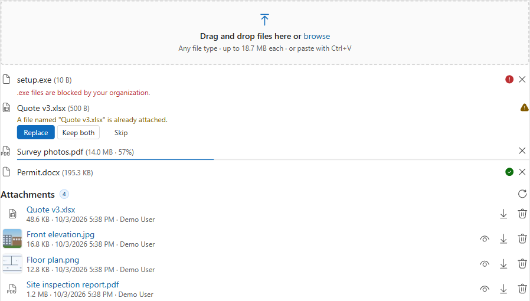

<h1 align="center">PCF controls by Ankit Rana</h1>

<p align="center">
  Free, open-source <a href="https://learn.microsoft.com/power-apps/developer/component-framework/overview">Power Apps component framework (PCF)</a> controls for Dynamics 365 / Dataverse model-driven apps.
</p>

<p align="center">
  <a href="LICENSE"></a>
  
  
  
</p>

---

## Controls

| Control | What it does | Docs | Status |
|---|---|---|---|
| [**File Drop Zone**](FileDropZone/) | Drag and drop (or paste) files onto a form to save them as Note attachments on the record. Large files upload in blocks with progress and cancel; follows the environment's file size and blocked-type rules; handles duplicates; lists, previews, downloads and deletes existing attachments. | [User guide](FileDropZone/docs/user-guide.md) · [Word](FileDropZone/docs/FileDropZone-User-Guide.docx) · [PDF](FileDropZone/docs/FileDropZone-User-Guide.pdf) · [Setup walkthrough](FileDropZone/docs/setup-walkthrough.html) | [](https://github.com/ankitrana/PCF-Controls/actions/workflows/file-drop-zone.yml) |
| [**Signature Pad**](SignaturePad/) | Sign or draw with mouse, pen or touch and save the picture as a PNG Note attachment. Eraser to rub out and redraw part of it, undo / redo / clear, a short note with each image (*First floor*, signer's name...), edit, download and delete saved images, newest first. Signature or Drawing mode. | [User guide](SignaturePad/docs/user-guide.md) · [Word](SignaturePad/docs/SignaturePad-User-Guide.docx) · [PDF](SignaturePad/docs/SignaturePad-User-Guide.pdf) · [Setup walkthrough](SignaturePad/docs/setup-walkthrough.html) | [](https://github.com/ankitrana/PCF-Controls/actions/workflows/signature-pad.yml) |

<p align="center">
  
</p>

## Install

1. Open [Releases](https://github.com/ankitrana/PCF-Controls/releases) and download the managed solution for the control you want from the latest release's *Assets*:
   - **File Drop Zone**: `ArtFileDropZone_managed.zip`
   - **Signature Pad**: `ArtSignaturePad_managed.zip`
2. In [make.powerapps.com](https://make.powerapps.com), pick your environment and go to **Solutions** > **Import solution**.
3. Add the control to a form. Each control's user guide walks through it.

Prefer to build from source? Each control's README explains how.

## Feedback

Bugs, ideas, or a control you wish existed? [Open an issue](https://github.com/ankitrana/PCF-Controls/issues/new/choose) and pick the control from the list.

## Repository layout

```
PCF-Controls/
├── FileDropZone/      one folder per control: PCF project, docs/, README, CHANGELOG
├── SignaturePad/
├── .github/           issue forms and one build workflow per control
└── LICENSE            MIT, applies to all controls
```

## Author

**Ankit Rana**, Dynamics 365 / Power Platform Solutions Architect
[LinkedIn](https://www.linkedin.com/in/mrankitrana/) · [GitHub](https://github.com/ankitrana)
