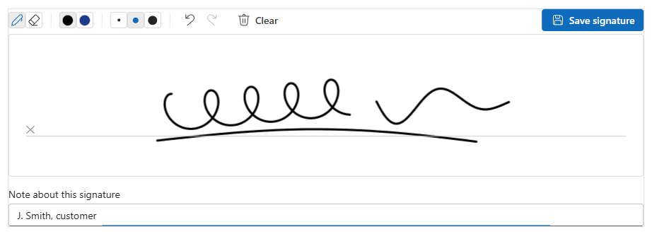
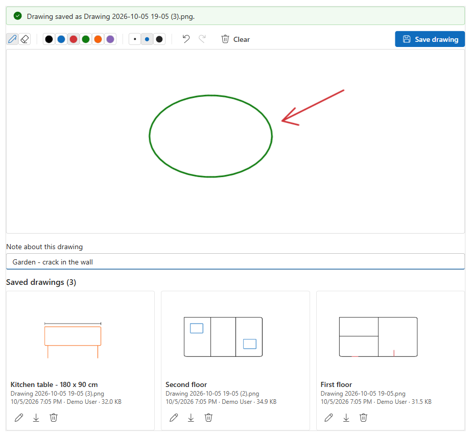

# Signature Pad

Sign or draw on a Dynamics 365 / Dataverse model-driven form with a mouse, pen or finger. The picture is saved as a **PNG Note attachment** (`annotation`) on the current record, for example `Signature 2026-10-05 14-30.png`, so it shows in the timeline and works with flows, reports and Word templates.

  [](https://github.com/ankitrana/PCF-Controls/actions/workflows/signature-pad.yml)



📘 **[User guide](docs/user-guide.md)**: install, add to a form, every setting explained, security and troubleshooting. Also as [Word](docs/SignaturePad-User-Guide.docx) and [PDF](docs/SignaturePad-User-Guide.pdf).

🧭 **[Setup walkthrough](docs/setup-walkthrough.html)**: every screen you go through to put the control on a form (build, import, table, form, component, publish), with numbered pins on each screen. It is a web page: download it (Download raw file) together with the `docs/img` folder, or open it from a clone, in any browser.

## Features

- **Signature or Drawing mode**: one cropped signature per record, or a bigger canvas with six colours and a list of saved drawings.
- **Eraser**: rub out part of the picture and draw that part again.
- **Undo / redo / clear**: every stroke, eraser stroke and *Clear* can be undone (Ctrl+Z / Ctrl+Y).
- **Mouse, pen and touch**: smooth lines; pen pressure makes the line thicker.
- **Note with each image**: a short note such as *First floor*, *Kitchen table* or the signer's name, saved in the Note's description and shown as the image's title. Optional, required or off.
- **Edit saved images**: open a saved image on the pad, change it and save it back to the same Note.
- **Newest first**: saved images are listed newest first, with download and delete.
- **Your file name**: `Signature.png`, `Customer signature 2026-10-05 14-30.png`... Replace the earlier image or keep them all.
- **Required signature**: optionally writes the file name into the host column, so business rules and views can check for it.
- **Modern UI**: React + Fluent UI v9 from the platform, follows the app's theme.



## Settings

Add the control to **any single line text column** on the form.

| Setting | Default | Description |
|---|---|---|
| Mode | Signature | *Signature* (cropped, shown in place of the pad once saved) or *Drawing* (pad + list of saved drawings). |
| Image name | *(empty)* | File name without `.png`. Empty = `Signature` / `Drawing`. |
| Add date to file name | Yes | `Signature 2026-10-05 14-30.png` instead of `Signature.png`. |
| When a new image is saved | Replace | Replace the earlier image(s) with the same name, or keep them all. |
| Note title | *(empty)* | Note subject. Empty = image name. |
| Note with each image | Optional | Optional / Required / Off. Saved in the Note's description. |
| Pen colour | *(empty)* | Starting colour, e.g. `#1F3B8C`. Empty = black. |
| Pen width (px) | *(empty)* | 1-20. Empty = 3. |
| Pad height (px) | *(empty)* | 100-1200. Empty = 200 (signature) / 360 (drawing). |
| Image background | White | White or transparent PNG. |
| Allow delete | Yes | Show the delete button (security roles still apply). |
| Fill host field when saved | No | Write the newest file name into the host column (the form then needs saving). |

## Install

Download **`ArtSignaturePad_managed.zip`** from the latest `SignaturePad-v*` release on the [Releases page](https://github.com/ankitrana/PCF-Controls/releases), then in [make.powerapps.com](https://make.powerapps.com) go to **Solutions** > **Import solution** and import it. The [user guide](docs/user-guide.md) has the full steps.

## Build

Requirements: Node.js 18+ and the [Power Platform CLI](https://learn.microsoft.com/power-platform/developer/cli/introduction).

```bash
npm ci
npm run build
```

Try it locally in the PCF test harness (demo mode, images kept in memory):

```bash
npm start watch
```

## Deploy

Quick push to a **development** environment:

```bash
pac auth create --environment https://yourorg.crm.dynamics.com
pac pcf push --publisher-prefix <yourprefix>
```

Or build the managed solution yourself (publisher AnkitRanaTech, prefix `art`). The [.NET SDK](https://dotnet.microsoft.com/download) is also needed:

```bash
dotnet build Solution/SignaturePadSolution.cdsproj -c Release
```

This writes the managed solution to `Solution/bin/Release/SignaturePadSolution.zip`.

### Releasing (maintainer)

Bump the version in `ControlManifest.Input.xml`, `package.json` and `CHANGELOG.md`, commit, then push a tag `SignaturePad-v<version>`. CI checks that the tag matches the manifest, builds the managed solution and publishes a GitHub release with `ArtSignaturePad_managed.zip` attached.

Then in the form designer: select a single line text column > **Components** > **+ Component** > **Signature Pad (AnkitRana-Tech)**, set the options, save and publish.

## Roadmap

- Type a signature (name in a handwriting font) as a keyboard-friendly alternative
- Background picture or floor plan to draw on
- Save to an Image or File column instead of a Note
- Translations (.resx)

See [CHANGELOG.md](CHANGELOG.md) for version history.

## License

[MIT](../LICENSE) © Ankit Rana
