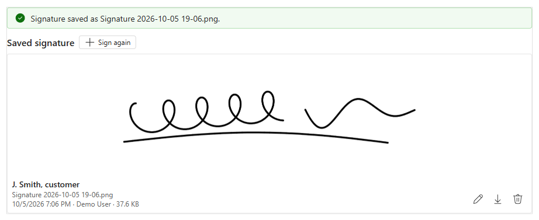
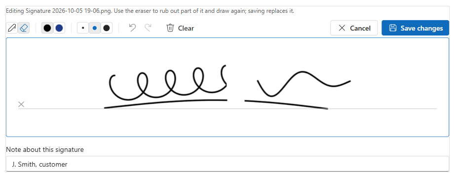

# Signature Pad - User Guide

**Version 0.1.0** · PCF control for Dynamics 365 / Dataverse model-driven apps · by Ankit Rana

Signature Pad adds a signing and drawing area to any model-driven form. Users sign or draw with a mouse, pen or finger, rub out part of it with the eraser and draw that part again, and save. The picture is saved as a **PNG Note attachment** on the record (for example `Signature 2026-10-05 14-30.png`), the same place the timeline's *Add attachment* puts files, so flows, reports and Word templates can use it.

## Contents

1. [Features](#1-features)
2. [Requirements](#2-requirements)
3. [Install the solution](#3-install-the-solution)
4. [Add the control to a form](#4-add-the-control-to-a-form)
5. [Settings reference](#5-settings-reference)
6. [Using the control](#6-using-the-control)
7. [How images are saved](#7-how-images-are-saved)
8. [Security](#8-security)
9. [Troubleshooting](#9-troubleshooting)
10. [Update or uninstall](#10-update-or-uninstall)

---

## 1. Features

| Feature | Details |
|---|---|
| Two modes | **Signature**: one signature per record, shown in place of the pad once saved, cropped to the ink. **Drawing**: a bigger canvas with six colours and a list of saved drawings, newest first. |
| Mouse, pen and touch | Smooth lines. With a pen (Surface Pen, Apple Pencil, Wacom), the line gets thicker the harder you press. |
| Eraser | Rub out part of the picture and draw that part again. Three eraser sizes. |
| Undo / redo | Undo and redo every stroke, eraser stroke and *Clear* (**Ctrl+Z** / **Ctrl+Y**). |
| Clear | Wipes the whole pad in one click. It can be undone. |
| Colours and sizes | Thin, medium and thick pen. Black and blue in Signature mode; black, blue, red, green, orange and purple in Drawing mode. |
| Edit saved images | Open a saved signature or drawing on the pad, erase or add to it, and save it back to the same Note. |
| Saved list | Saved images are listed newest first; an image you edit moves to the top. |
| Note with each image | Type a short note with each picture, for example *First floor*, *Kitchen table* or the signer's name. It is shown as the picture's title in the list and saved in the Note's description. Optional, required or off. |
| Delete | Remove a saved image, with confirmation. |
| Download | Save the PNG to the computer. |
| Image name | Saved as `Signature.png` / `Drawing.png` or your own name, with the date and time added if you want. |
| Replace or keep | Keep one image per record (the earlier one is deleted when a new one is saved), or keep them all. |
| Required signature | Optionally writes the file name into the host column, so a business rule or "required" setting can check that the record was signed. |
| Theme | Fluent UI v9 and the app's theme. The pad itself stays white, like paper. |

## 2. Requirements

- A Dataverse environment with **model-driven apps** (Unified Interface) in a browser (Edge, Chrome, Firefox, Safari). Canvas apps and Power Pages are not supported. Touch and pen work through the browser's pointer events; the Power Apps mobile app is not tested yet.
- The table you add it to must have **Attachments (including notes and files)** enabled
  (Power Apps > Tables > *your table* > Properties > Advanced options).
- A **single line of text** column on that table to host the control. The control doesn't change the column's value unless you turn on *Fill host field when saved*, so you can use any text column or create a dedicated one (for example *Signature*).
- System Customizer or System Administrator role to import the solution and edit forms.

## 3. Install the solution

1. Download `ArtSignaturePad_managed.zip` from the latest **Signature Pad** release on the [Releases page](https://github.com/ankitrana/PCF-Controls/releases) (under *Assets*).
2. Go to [make.powerapps.com](https://make.powerapps.com) and pick the environment (install in a sandbox or dev environment first).
3. **Solutions** > **Import solution** > **Browse** > select the zip > **Next** > **Import**.
4. Wait for the "Solution imported successfully" message.

The solution contains only the control. It does not add tables, columns, flows or security roles, and it does not send data anywhere outside your environment.

## 4. Add the control to a form

1. In **make.powerapps.com**, open a solution (or **Tables**) > your table > **Forms** > open the main form.
2. Add the host text column to the form if it's not there yet. A one-column section of its own works best.
3. Select the column, then in the right-hand **Properties** pane open **Components** > **+ Component**.
4. Choose **Signature Pad (AnkitRana-Tech)**.
5. Set the options (see [Settings reference](#5-settings-reference)), leave **Web**, **Mobile** and **Tablet** ticked, and click **Done**.
6. Optional: in the column's Properties, tick **Hide label** to let the pad use the full width.
7. **Save and publish** the form.

> Classic form editor: double-click the column > **Controls** tab > **Add Control...** > *Signature Pad (AnkitRana-Tech)* > set the options > select the Web / Phone / Tablet radio buttons > **OK**.

You can put the control on the form more than once with different image names, for example *Customer signature* and *Engineer signature* on a work order. Each one only looks at its own images.

## 5. Settings reference

| Setting | Default | What it does |
|---|---|---|
| **Host field** | (required) | The text column the control sits on. Only changed when *Fill host field when saved* is Yes. |
| **Mode** | Signature | **Signature**: after saving, the saved signature is shown with *Edit*, *Sign again*, *Download* and *Delete*; the image is cropped to the ink. **Drawing**: the pad stays open with more colours, and saved drawings are listed under it; the image is the whole pad. |
| **Image name** | empty | File name without `.png`, for example `Customer signature`. Empty = `Signature` or `Drawing`. Characters not allowed in file names (`\ / : * ? " < > \|`) are removed. |
| **Add date to file name** | Yes | Yes: `Signature 2026-10-05 14-30.png`. No: `Signature.png`. |
| **When a new image is saved** | Replace the earlier image | **Replace**: after a new image is saved, the earlier images with the same name are deleted, so the record keeps one. **Keep**: every saved image stays (a second image with the same name gets ` (2)`). |
| **Note title** | empty | Title (subject) of the Note. Empty = the image name. |
| **Note with each image** | Optional | **Optional**: a *Note about this signature/drawing* box under the pad. **Required**: the image can't be saved without a note. **Off**: no box. The note is saved in the Note's description (`notetext`), shown as the image's title in the list, and can be changed with *Edit*. Up to 250 characters. |
| **Pen colour** | empty (black) | Starting colour as a hex code, for example `#1F3B8C`. A colour that isn't in the palette is added to it. |
| **Pen width (px)** | empty (3) | Starting pen thickness, 1 to 20. Thin is 0.6× and thick is 2× this. |
| **Pad height (px)** | empty | Height of the drawing area, 100 to 1200. Empty = 200 (Signature) or 360 (Drawing). The width always follows the form. |
| **Image background** | White | **White** or **Transparent** background in the saved PNG. Transparent suits signatures placed on top of documents. |
| **Allow delete** | Yes | Show the delete button on saved images. Users still need Delete permission on Notes. |
| **Fill host field when saved** | No | Yes: write the newest file name into the host column after a save, and clear it when the last image is deleted. The form then has unsaved changes, so the user saves the form. Use it to check for a signature in business rules, views or flows. |

**Example setups**

- *Customer sign-off on a Work Order*: Mode `Signature`, Image name `Customer signature`, Note with each image `Required` (the signer types their name), Pen colour `#1F3B8C`, Fill host field when saved `Yes`.
- *Damage sketch on an Inspection table*: Mode `Drawing`, Image name `Damage sketch`, When a new image is saved `Keep`, Note with each image `Required` (users write *First floor*, *Kitchen table*...), Pad height `450`.

## 6. Using the control

- **Sign or draw**: draw on the white area with a mouse, pen or finger. Choose a colour and a thickness in the toolbar.
- **Rub out part of it**: pick the **Eraser** (and a size), rub over the part to remove, switch back to the **Pen** and draw it again.
- **Undo / redo**: the arrow buttons, or **Ctrl+Z** / **Ctrl+Y** while the pad has focus.
- **Start over**: **Clear** wipes the pad. Changed your mind? Undo brings it back.
- **Note**: type what the picture is in *Note about this signature / drawing* under the pad, for example *Second floor* or the signer's name. It becomes the picture's title in the list.
- **Save**: click **Save signature** / **Save drawing**. The picture is saved as a Note on the record straight away; saving the form is not needed (unless *Fill host field when saved* is on).
- **Edit a saved image**: click the pencil on a saved image. It opens on the pad with its note; erase or add to it, change the note if needed, then **Save changes**. The same Note is updated, its file name gets the new date, and it moves to the top of the list.
- **Sign again** (Signature mode): starts a fresh signature. With *Replace*, the old signature is deleted once the new one is saved. **Cancel** goes back to the saved one.
- **Download / delete**: the buttons on each saved image. Delete asks first.
- **Unsaved strokes**: switching to another image or cancelling asks before throwing away strokes that weren't saved. Leaving the record does not ask, so save first.
- **New record**: the pad works, but saving shows *"Save the record first, then save the signature."* Save the record, then click Save on the pad.
- **Read-only form or inactive record**: saved images are shown with Download only. If there are none, the control says so.

## 7. How images are saved

| Item | Details |
|---|---|
| Format | PNG, at twice the on-screen size so it stays sharp in documents and when printed. A signature is usually 20 to 60 KB. |
| Where | A Note (`annotation`) on the record: *Title* = Note title setting, *Description* = the user's note, *File name* = image name (+ date), *MIME type* `image/png`. It shows in the timeline. |
| Cropping | Signature mode crops the image to the ink with a small margin. Drawing mode saves the whole pad. |
| Which images the control shows | Only PNG Notes on this record whose file name is the image name, optionally followed by the date and ` (2)`, ` (3)`... Other attachments are never shown, changed or deleted. |
| Replace | With *Replace the earlier image*, saving a new image deletes the control's earlier images (same rule as above). Editing an image updates that Note and leaves the others alone. |

> **Is this a legal e-signature?** The control stores a picture of a signature with who saved it and when (the Note's *Modified by* / *Modified on*). It does not verify identity or seal the document. For contracts that need a certified electronic signature, use a dedicated e-signature service.

## 8. Security

The control uses the signed-in user's own permissions. Nothing is elevated. Users need:

| To... | Privilege needed |
|---|---|
| See saved images | Read on **Note** |
| Save a new image | Create on **Note**, Append on **Note**, Append To on the **record's table** |
| Edit a saved image | Write on **Note** |
| Delete, or save with *Replace* | Delete on **Note** (and the *Allow delete* setting on, for the delete button) |
| Fill host field when saved | Write on the record's table |

With *Replace*, a user who can create Notes but not delete them still saves the new image; the control then says the earlier image could not be removed.

## 9. Troubleshooting

| Problem | Fix |
|---|---|
| Control doesn't appear in the component list | Check that the solution imported, and that you selected a **single line of text** column. |
| "Save the record first, then save the signature." | The record is new. Save it once, then click Save on the pad. |
| Save fails with a message about `objectid_...` | Notes aren't enabled on the table. Turn on **Attachments (including notes and files)** in the table's advanced options (this can't be turned off again later). |
| Save button stays grey | The pad is empty. Draw something first. |
| "Add a note about this ... before saving." | *Note with each image* is Required. Type a note under the pad. |
| "There is nothing to save." | Everything was erased. Undo, or draw again. |
| A saved signature isn't shown | It has a different file name (for example it was renamed, or the *Image name* setting changed). The control only shows its own images; see [How images are saved](#7-how-images-are-saved). |
| Page scrolls instead of drawing on a phone | Start the stroke inside the white area; the pad blocks scrolling only there. |
| Form says it has unsaved changes after signing | *Fill host field when saved* is Yes, which writes to the host column. Save the form. |
| Delete button missing | *Allow delete* is No, the form is read-only, or the record is inactive. |

Still stuck? Open an issue with the control version, browser, steps and the error text. Please don't include customer data or org URLs.

## 10. Update or uninstall

- **Update**: import the newer managed zip over the existing one (Solutions > Import > *Upgrade*). Form settings are kept.
- **Uninstall**: remove the control from every form first (form > column > Components > delete the component > Save and publish), then delete the **Signature Pad** solution. Saved images are Notes, so they stay on the records.

---

License: MIT. Free to use, provided as is without warranty. Test in a non-production environment before rolling out.
